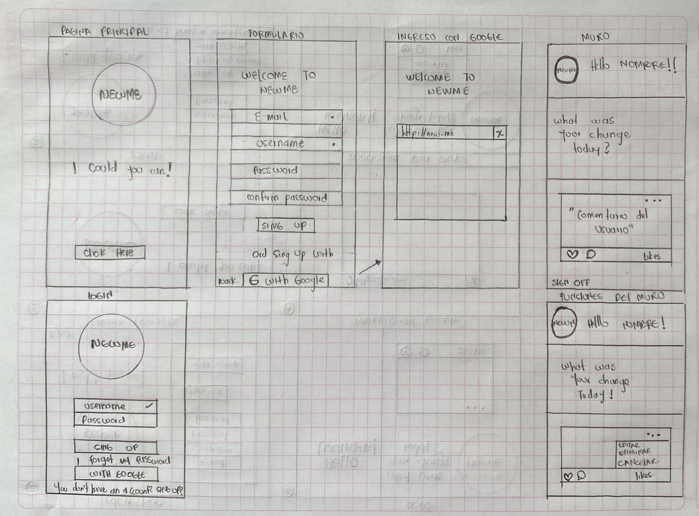
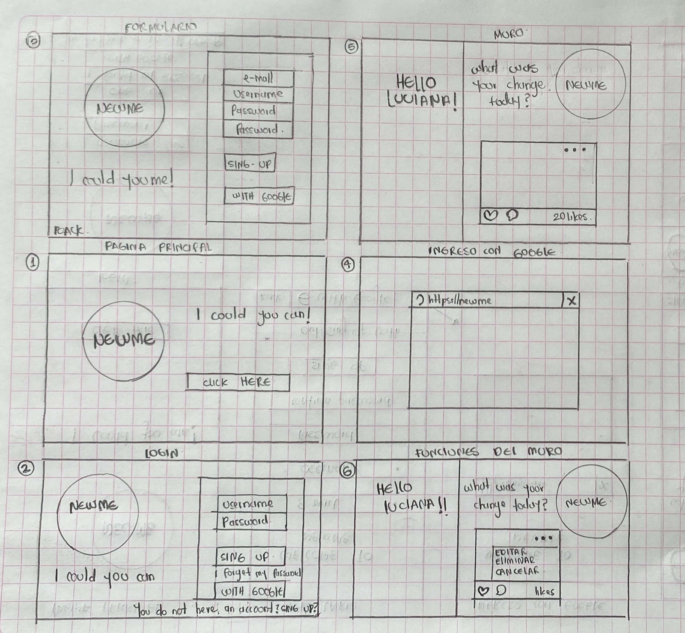
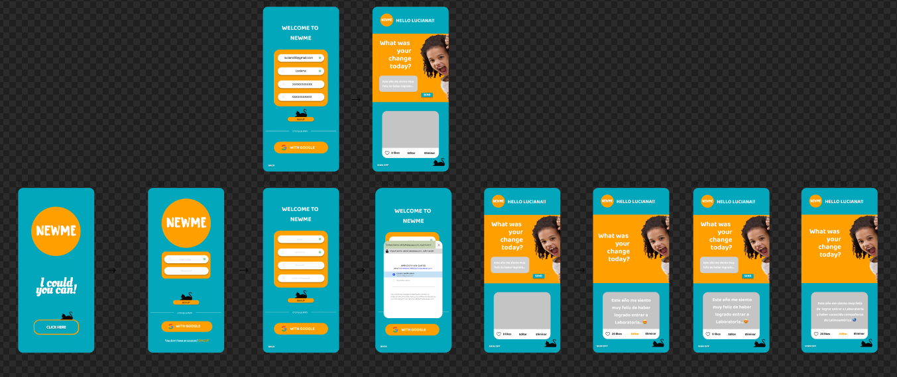
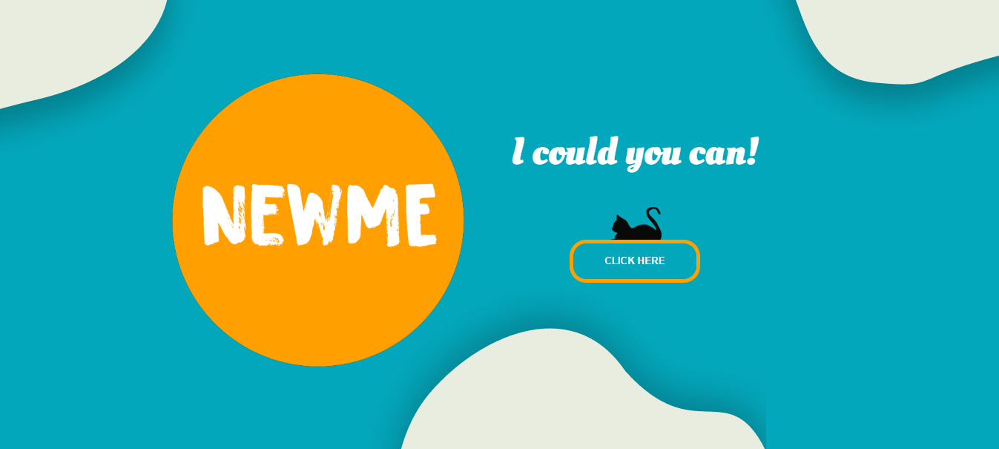
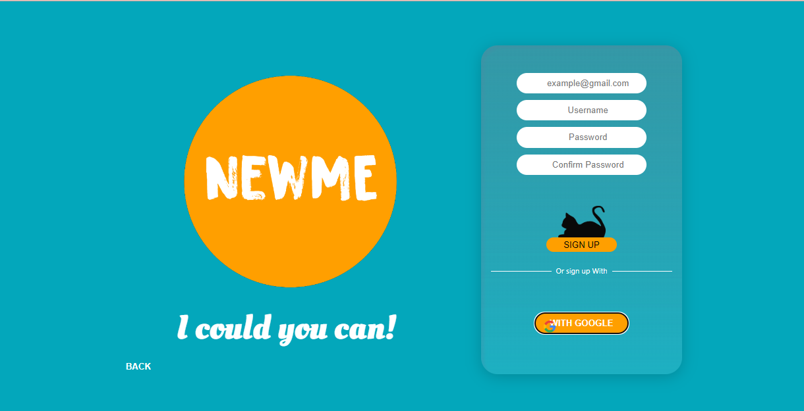
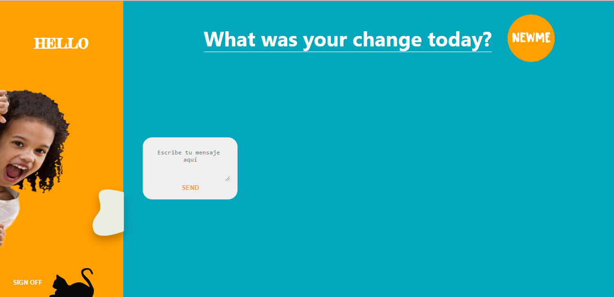
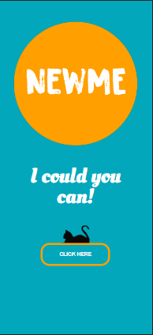
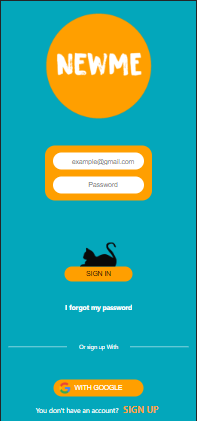
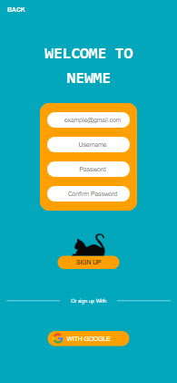
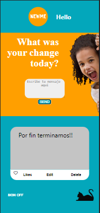

# Proyecto Social Network
# **NEWME**

## Índice

* [1. Definición del producto](#1-definición-del-producto)
* [2. Principales usuarios](#2-princiaples-usuarios)
* [3. Objetivos de los usuarios en relación al producto](#3-objetivos-producto)
* [4. Qué problema resuelve el producto / para qué le servirá a estos usuarios](#4-problemas-resuelve)
* [5. Prototipos](#5-prototipos)
* [6. Historias de usuario](#6-Historias-de-usuario)
* [7. Herramientas de elaboración](#7-Herramientas-de-elaboración)
* [8. Test de Usabilidad](#8-Test-de-usabilidad)
* [9. Autoras](#9-Autoras)

***

## **Sitio web** 

[NEWME](https://social-network-009.netlify.app/)

## **1.Definición del producto**

Nuestra red social es una plataforma Web y Mobile para que lxs usuarixs muestren sus cambios, esos cambios que le llenan de orgullo o cambios que representan una parte muy importante dentro de sus vidas; Nada como contarle a otrxs personas tus logros y que celebren contigo.

Video de guía, o idea: https://trends.google.com/trends/yis/2022/CO/

## **2. Principales Usuarios**

Cualquier persona que desee contarle a su red de amigos, familiares o conocidos los acontecimientos importantes de su vida; Cambios que al día de lo hoy lx hacen sentir diferente o aquella situación que cambio su vida dándole un giro de 180°

## **3. Objetivos del usuario en relación al producto**

- Lograr que el usuario pueda compartir sus cambios o logros
- Permitir que el usuario encuentre una red social donde no tenga miedo de mostrar sus cambios.
- Permitir al usuario interactuar con amigos y conocidos.

## **4. Qué problema resuelve el producto / para qué le servirá a estos usuarios**

Permitirá contar sus historias de vida o mostrar los cambios que le han traído felicidad, o algun sentimiento que le ha representado un cambio significativo a su vida.

## **5. Prototipos**

### **5.1 Baja Fidelidad**

 **Mobile**

**Desktop**

### **5.2 Alta Fidelidad **

 **Mobile**

Link figma: [MOBILE](https://www.figma.com/proto/EMobDkb3y8fidc9gCxUdXJ/Untitled?node-id=8%3A2&scaling=scale-down&page-id=0%3A1&starting-point-node-id=8%3A2)

**Desktop**

Link figma: [DESKTOP](https://www.figma.com/proto/EMobDkb3y8fidc9gCxUdXJ/Untitled?node-id=49%3A69&scaling=scale-down&page-id=49%3A70&starting-point-node-id=49%3A69
)

### **5.3 DISEÑO FINAL PROYECTO**

**Desktop**

**Mobile**

## **6. Historias de Usuario**

Se utilizo la herramiento de GitHub projects [Ver aquí](https://github.com/users/PQ2505/projects/2) 

## **7. Herramientas utilizadas**

- JavaScript
- Jest
- Firebase
- Git 
- GitHub
- Figma
- CSS3
- HTML5
- Visual studio Code

## **8. Test de Usabilidad**

De los test de usabilidad descatacamos los siguientes comentarios:

- Los colores son llamativos y acorde a la temática que estamos utilizando.
- La red social es muy intuitiva.
- Al estar en inglés aumenta el rango de acogida.
- Al iniciar con el desarrollo combinabamos idiomas y nos hicieron la sugerencia de hacerlo en un solo idioma.

## **9. Autoras**

- Paola Quiroga
- Sandra Ríos
- Erika Ríos Suesca

